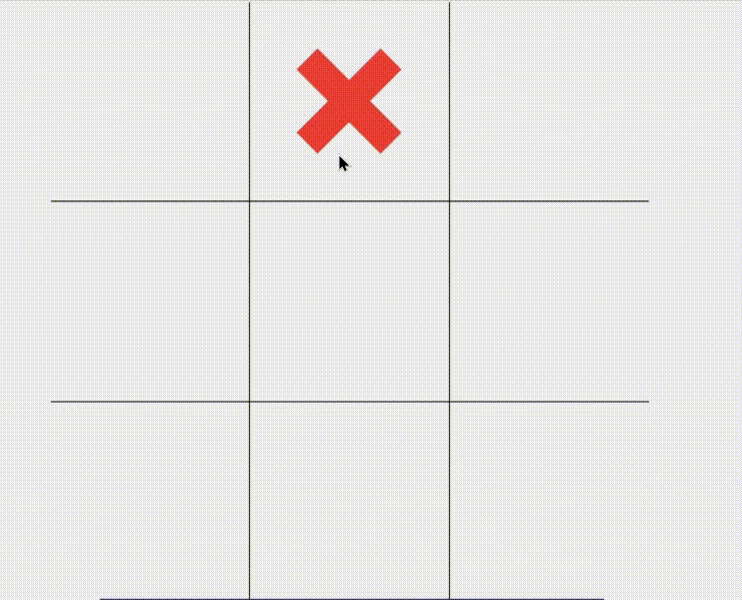

# A Tic-Tac-Toe Game by Sushant and Alok

Tic-Tac-Toe is a famous children's game and we all would have surely played it on a piece of paper! This code implements this game in the form of a bright and colorful interface using the library Tkinter along with the evergreen concepts of object oriented programming.

## How to play?

As soon as the user runs the code, a window pops out displaying the board of the game. Then Player 1 gets to move first by clicking on the box using the mouse he/she wants to fill. Then the game progresses in the usual manner until one of the two players win. This software also provides the all-important feature of keeping track of results between the 2 players. Note this history only gets saved until the window is closed. This opens the option of playing a war of multiple battles with your friend. Another great feature provided by this game is that the player getting the first turn switches after every game in order to ensure a fair contest.

## Demo

Here is a demo to the interface of this game: 

## Authors

- [@Alok363](https://www.github.com/Alok363) - B21CS006
- [@SushantRavva](https://www.github.com/SushantRavva) - B21CS084

## Documentation

[Tkinter GUI Python Library](http://tkdocs.com)
[Python Documentation](https://docs.python.org/3)

